# Cosmic Briefing — n8n + Ollama + Groq

**Autor:** autor · **Asignatura:** Programación para IA — Unidad 9 · **Fecha:** 2026-04

## 1. Objetivo

Cada mañana a las 08:00 mi workflow de n8n se levanta solo, llama a 8 fuentes públicas de astronomía y espacio, junta los datos, los agrupa por tema con embeddings, y le pide a un LLM que escriba un resumen en castellano. Ese resumen llega al móvil por Telegram con la imagen del día y un enlace a un panel web. Cada briefing también se guarda en una hoja de Sheets para poder consultarlo después.

A eso le añadí un chatbot del mismo bot de Telegram. Le escribes y te contesta usando dos herramientas que consultan los briefings guardados. Recuerda lo que le has preguntado antes (tiene memoria por chat).

No es un RAG. No hay vector store ni indexación de documentos. Lo que hago es mezclar 8 fuentes en directo, agruparlas con clustering y narrarlas con un LLM.

## 2. Arquitectura

Todo vive en un único fichero: `autor_workflow.json`. Dentro hay tres ramas que no se cruzan entre ellas, cada una con su propio trigger:

| Rama | Trigger | Lo que hace |
|---|---|---|
| **A — Briefing diario** | Schedule cron `0 8 * * *` | 8 APIs → consolidar → embeddings → clustering → LLM Ollama → Telegram + Sheets |
| **B — Chatbot** | Telegram Trigger | AI Agent (Groq) con memoria + 2 tools que consultan Sheets → respuesta a Telegram |
| **C — Errores** | Error Trigger | Si algo peta en cualquier nodo, me avisa por Telegram |

El Apps Script (`Code.gs`) es la capa de Sheets. Tiene cuatro endpoints, todos los uso desde algún nodo del workflow:

- `POST` — lo llama el nodo `16. Google Sheets (log)` para guardar cada briefing.
- `GET ?action=last&n=N` — lo llama la tool `ultimos_briefings` del agente.
- `GET ?action=search&q=X` — lo llama la tool `buscar_briefing` del agente.
- `GET ?action=dashboard` — devuelve el panel HTML. Su URL la pego dentro del propio mensaje de Telegram del briefing diario, así desde el chat se puede abrir el histórico.

**Embeddings y clustering.** Cojo los titulares de papers, noticias, lanzamientos y asteroides, le saco un vector de 768 dimensiones a cada uno con `nomic-embed-text` y los agrupo con un clustering greedy de similitud coseno (umbral 0,70). Los grupos los meto en el prompt para que el LLM detecte que tres noticias hablan del mismo tema y no las repita tres veces.

## 3. Origen del proyecto y decisiones técnicas

**De dónde sale la idea.** En clase vimos un RAG sobre Google Drive. El enunciado dejaba claro que un RAG simple no daba para mucho, así que descartado. A mí siempre me ha tirado el espacio (NASA, ISS, ciencia ficción), y la sección 5 del enunciado proponía como ejemplo un «resumidor de noticias» con cron + RSS + LLM + Telegram. Cogí esa estructura, la pasé a tema astronomía y la fui ampliando con más fuentes y un chatbot.

**Local en lugar del n8n del profesor.** El servidor `progian8n.duckdns.org` estuvo varias horas caído cuando me quedaban días para entregar. No quería depender de algo que no controlo, así que monté todo en local con el `self-hosted-ai-starter-kit` (n8n + Ollama + Postgres + Qdrant en Docker) y lo expuse con ngrok.

**Groq para el chatbot, Ollama para el briefing.** Mi GPU es una GTX 960M con 2 GB de VRAM. Ollama ya no la soporta, así que todo corre en CPU. `qwen2.5:1.5b` en CPU narra el briefing en pocos segundos pero falla al elegir herramientas; `qwen2.5:3b` tarda 30-60 s y rompe el webhook de Telegram. Por eso el chatbot lo paso a Groq (`llama-3.3-70b-versatile`), que es gratuito y va en milisegundos. El briefing diario sigue siendo 100 % Ollama local.

**Un solo workflow.** El enunciado pide en singular `apellido_nombre_workflow.json`. Las tres ramas (briefing, chatbot, errores) caben en el mismo fichero compartiendo bot, hoja y modelo de embeddings. Más simple para entregar y para enseñar en el vídeo.

**`onError: continueRegularOutput` en las 8 fuentes externas.** Si una API se cae (NeoWs, Launch Library 2…), el workflow no se rompe. La consolidación trabaja con lo que hay y pone valores por defecto para los que faltan.

## 4. Despliegue

El detalle paso a paso está en la **§11 de la memoria adjunta** (`autor_memoria.docx`). Lo esencial:

- Levantar el `self-hosted-ai-starter-kit` con `docker compose up -d`.
- Descargar los modelos dentro del contenedor `ollama` con `docker exec -it ollama ollama pull qwen2.5:1.5b` y `docker exec -it ollama ollama pull nomic-embed-text`.
- Crear dos credenciales en n8n: Telegram y Groq. Los nodos del briefing llaman a Ollama por HTTP directo, no necesitan credencial.
- Pegar `Code.gs` en el Apps Script de la hoja Cosmic Briefing y desplegar como Web App pública.
- Lanzar ngrok en una PowerShell para que el Telegram Trigger sea accesible desde fuera.
- Importar `autor_workflow.json` en n8n, asignar las credenciales en los dos nodos que las piden y activar el workflow.

## 5. Incidencias y soluciones

| Problema | Solución |
|---|---|
| Las celdas de Sheets se llenaban con `#NAME?` | n8n dejaba `=` al inicio de los valores. Se lo strippeo en Apps Script y en el nodo de consolidación |
| Los `\n` aparecían como literal en Telegram | En las expresiones de n8n hay que escapar doble: `\\n` |
| Ollama crasheaba al usar GPU | La GTX 960M (compute 5.0) ya no la soporta. Forzado CPU con `options.num_gpu: 0` |
| Modelos 3B no entraban en VRAM | Cambiado a `qwen2.5:1.5b` para el briefing y a Groq para el chatbot |
| El modelo se descargaba de RAM entre ejecuciones | `keep_alive: "30m"` lo mantiene cargado |
| El LLM ponía asteriscos pese al prompt | Post-procesado con regex en el nodo Telegram para quitarlos |
| El briefing salía cortado a mitad de frase | Subido `num_predict` a 500 y `num_ctx` a 3072 |
| Tool calling con qwen pequeño no era fiable | Movido el chatbot a Groq |
| Si una API caía, se rompía toda la cadena | `onError: continueRegularOutput` en los 8 nodos HTTP |
| El n8n del profesor no respondía | Migrado a un n8n local en Docker expuesto con ngrok |
| ngrok hay que arrancarlo a mano cada vez | Documentado en la memoria §11.4. Pendiente: meterlo como contenedor del kit con `NGROK_AUTHTOKEN` en `.env` para que arranque junto a los demás |

## 6. Estructura del repositorio

```
autor_workflow.json     ← workflow exportado de n8n
autor_readme.md         ← este documento
autor_memoria.docx      ← memoria técnica extensa con código y capturas
```

## 7. Recursos y referencias

No es bibliografía formal, es la lista de páginas que he tenido abiertas mientras montaba el proyecto.

**Plataforma y entorno**

- n8n self-hosted-ai-starter-kit (n8n + Ollama + Postgres + Qdrant en Docker) — `https://github.com/n8n-io/self-hosted-ai-starter-kit`
- Documentación oficial de n8n — `https://docs.n8n.io/`
- AI Agent en n8n — `https://docs.n8n.io/integrations/builtin/cluster-nodes/root-nodes/n8n-nodes-langchain.agent/`
- Window Buffer Memory — `https://docs.n8n.io/integrations/builtin/cluster-nodes/sub-nodes/n8n-nodes-langchain.memorybufferwindow/`
- Tool HTTP Request — `https://docs.n8n.io/integrations/builtin/cluster-nodes/sub-nodes/n8n-nodes-langchain.toolhttprequest/`
- ngrok (túnel) — `https://ngrok.com/download`

**Modelos y LLM**

- Ollama, motor local — `https://ollama.com`
- Catálogo de modelos de Ollama — `https://ollama.com/library`
- Documentación de la API de Ollama (`/api/embed`, `/api/generate`) — `https://github.com/ollama/ollama/blob/main/docs/api.md`
- Groq (tier gratuito con `llama-3.3-70b-versatile`) — `https://console.groq.com/docs/quickstart`

**APIs de datos del briefing**

- NASA APOD y NeoWs — `https://api.nasa.gov/`
- Where the ISS at — `https://wheretheiss.at/w/developer`
- Launch Library 2 (TheSpaceDevs) — `https://ll.thespacedevs.com/2.2.0/swagger/`
- Open-Meteo — `https://open-meteo.com/en/docs`
- Sunrise-Sunset.org — `https://sunrise-sunset.org/api`
- arXiv RSS feeds — `https://info.arxiv.org/help/rss.html`
- SpaceNews RSS — `https://spacenews.com/feed/`

**Telegram y Apps Script**

- Telegram Bot API (`sendMessage`, webhooks) — `https://core.telegram.org/bots/api`
- Google Apps Script HtmlService — `https://developers.google.com/apps-script/reference/html/html-service`

**Inspiración para el formato del proyecto**

- El ejemplo «Resumidor de noticias» de la sección 5 del enunciado de la tarea (cron + RSS + LLM + Telegram), que adapté cambiando los temas a astronomía/espacio y ampliando las fuentes.
- El ejemplo de RAG visto en clase, del que aprendí cómo se enchufan embeddings, memoria y herramientas a un agente — aunque deliberadamente NO he hecho un RAG aquí.

## 8. Capturas

### 8.1. Workflow — Rama A (briefing diario)

La rama A es muy ancha y no cabe en una sola captura, así que la pongo en dos.

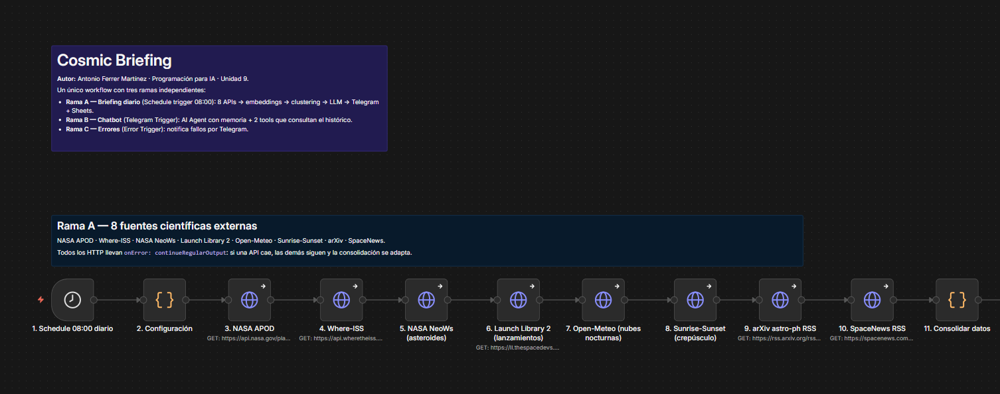

*Cabecera del workflow, sticky de las 8 fuentes externas y los nodos 1-11 (Schedule, Configuración, las 8 APIs y Consolidar datos).*

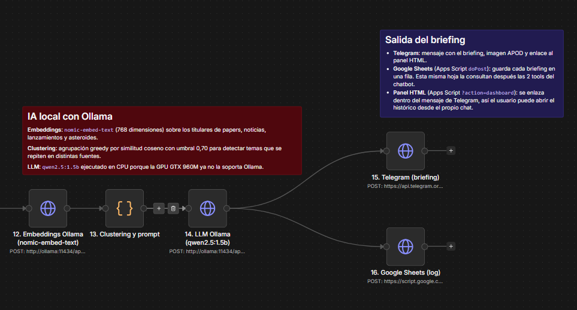

*Sticky de IA local con Ollama, sticky de la salida del briefing y los nodos 12-16 (Embeddings, Clustering, LLM, Telegram briefing y Sheets).*

### 8.2. Workflow — Rama B (chatbot)

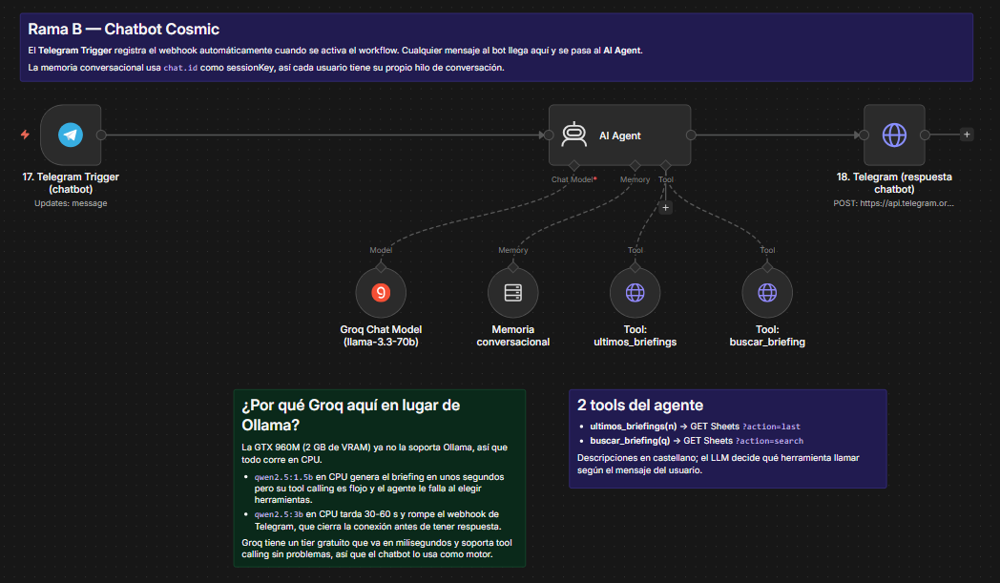

*Telegram Trigger → AI Agent → Telegram (respuesta), con los cuatro sub-nodos enchufados al agente: Groq Chat Model, memoria conversacional, tool ultimos_briefings y tool buscar_briefing.*

### 8.3. Workflow — Rama C (errores)

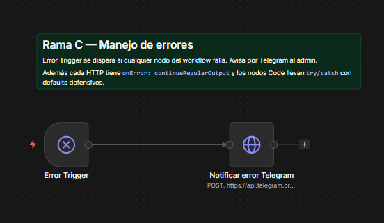

*Error Trigger global y el nodo que avisa por Telegram al admin.*

### 8.4. Una ejecución del chatbot funcionando

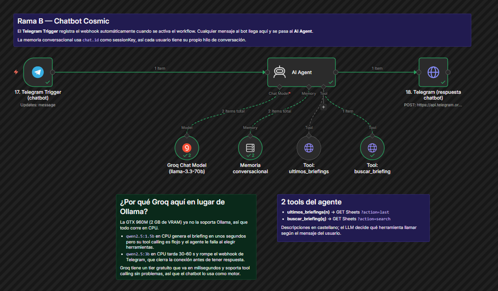

*Ejecución de la pregunta «Busca algo sobre SpaceX». Todos los nodos en verde, Groq se llama dos veces (decidir tool y redactar) y `buscar_briefing` lanza una petición al Apps Script.*

### 8.5. Briefing diario en Telegram

El mensaje es largo (11 ítems agrupados en 7 grupos), así que cabe partido en dos.

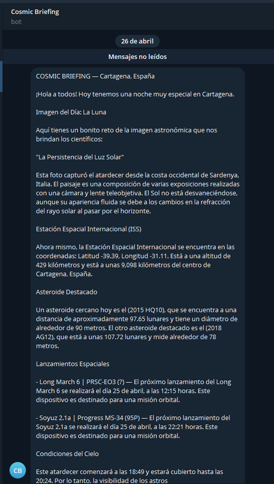

*Cabecera con la ciudad, saludo, imagen astronómica del día (APOD), posición de la ISS, asteroides cercanos detectados (NeoWs), próximos lanzamientos (Launch Library 2) y comienzo de las condiciones del cielo.*

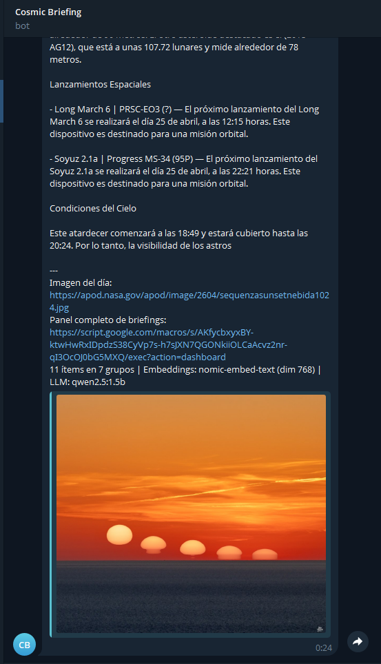

*Sigue con las condiciones de observación nocturnas, pie con la URL del APOD, enlace al panel HTML y la línea de métricas (11 ítems en 7 grupos · embeddings nomic-embed-text · LLM qwen2.5:1.5b). La imagen del APOD aparece incrustada al final porque Telegram lo hace automáticamente.*

### 8.6. Conversación con el chatbot

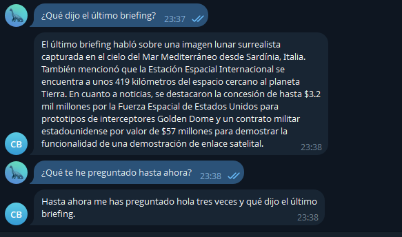

*El bot recibe «¿Qué dijo el último briefing?» y resume el contenido (ha llamado a `ultimos_briefings`). Después le pregunto qué le he preguntado antes y lo recuerda, así se ve que la memoria está enchufada.*

### 8.7. Panel HTML del histórico

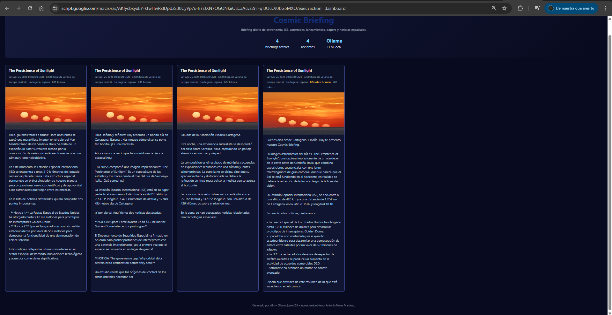

*Lo que devuelve el endpoint `?action=dashboard` del Apps Script: cabecera con los contadores y debajo una tarjeta por briefing. La etiqueta amarilla «ISS sobre tu zona» aparece si en ese momento la ISS estaba a menos de 2 000 km de Cartagena.*

### 8.8. Hoja de Google Sheets

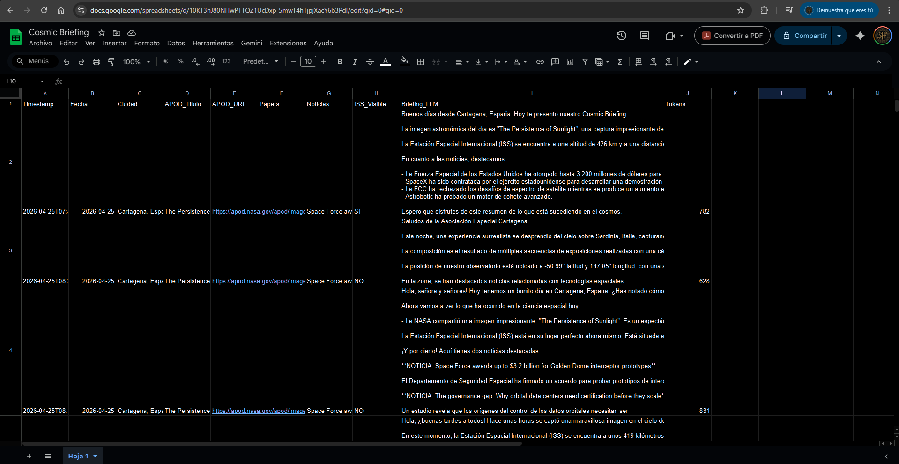

*Hoja Cosmic Briefing con las cabeceras correctas y los briefings persistidos. Esta misma hoja la consultan después las dos tools del chatbot.*

### 8.9. ngrok exponiendo n8n al exterior

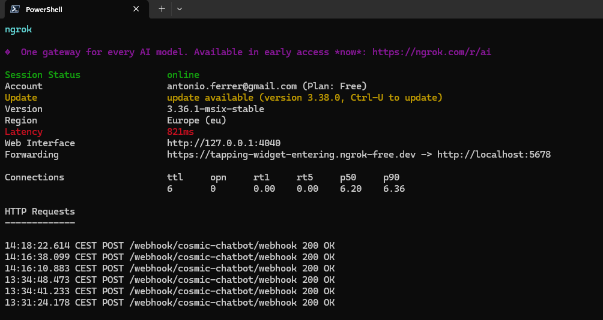

*Sesión de ngrok activa con el dominio estático `tapping-widget-entering.ngrok-free.dev` apuntando a `localhost:5678`. Abajo el log de HTTP Requests muestra los POST de Telegram entregándose en `/webhook/cosmic-chatbot/webhook` con `200 OK`. Es la prueba visual de que el túnel funciona y el chatbot recibe los mensajes.*
