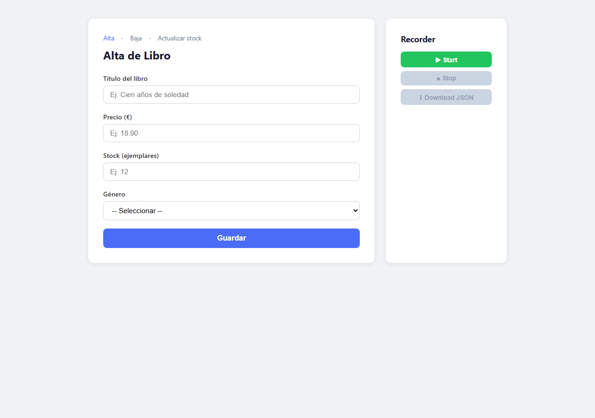
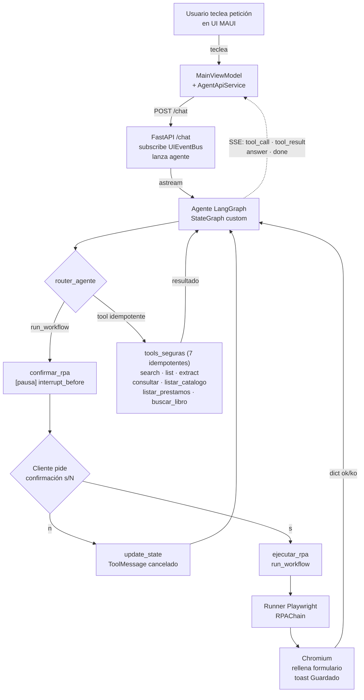
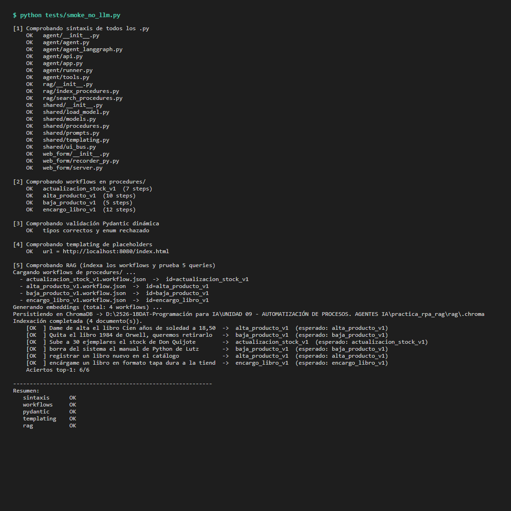

# RPA + RAG + Agente local — Sección de la Biblioteca Regional

Sistema local de automatización de procesos web (RPA) guiado por un agente LLM
con RAG sobre una biblioteca de procedimientos. El agente busca el workflow
apropiado en ChromaDB, extrae parámetros del lenguaje natural, valida contra
Pydantic y ejecuta los pasos en Playwright.

El **dominio funcional** es una **sección de la Biblioteca Regional** (estilo
BRMU): catálogo de libros con número de registro `R-NNNN` y signatura
topográfica, socios identificados con carnet `S-NNNN`, préstamos `P-NNNN` con
plazo de devolución, ajustes del fondo y bajas definitivas por extravío o
expurgo. **No es una librería: los libros se prestan, no se venden, no hay
precios.** El backend de catálogo y préstamos persiste en `data/catalogo.json`
y `data/prestamos.json`.

El proyecto incluye dos versiones del agente sobre las mismas tools: una con
`create_agent` de LangChain y otra con `StateGraph` propio de LangGraph con
HITL antes del RPA. Por defecto se ejecuta la versión LangGraph; la de
LangChain se activa con el flag `--lc` o `AGENT_BACKEND=langchain`.

### Notas sobre la adaptación del caso de uso

- **Dominio: biblioteca en lugar de tienda.** El formulario base se ha
  adaptado al caso "fondo de una sección de biblioteca regional"
  (préstamos, devoluciones, signaturas, copias_total / copias_disponibles,
  IDs estables `R/S/P-NNNN`) para enriquecer el caso de uso. Se mantiene el
  contrato técnico del formulario original (botón Guardar, toast de
  confirmación con `id="toast"` que contiene el texto "Guardado", inputs
  con `id`/`name` estables) para que el recorder JS y el runner Playwright
  funcionen exactamente igual que sobre el formulario de partida. Los
  placeholders del workflow (`{{titulo}}`, `{{autor}}`, etc.) y el nombre
  del workflow (`alta_libro.workflow.json`) reflejan el dominio nuevo.
- **HTML reescrito.** Las páginas del formulario (`index.html` para alta,
  más `baja.html`, `ajustar_copias.html`, `prestamo.html`,
  `devolucion.html` e `inventario.html`) se han escrito desde cero para
  cubrir las operaciones del dominio biblioteca, manteniendo el mismo
  panel del recorder JS (compartido como `recorder.js` + `recorder.css`)
  en todas ellas.
- **Modelo LLM: LM Studio + Qwen2.5-7B como referencia local.** El
  proyecto habla con cualquier endpoint compatible con la API de OpenAI
  (`/v1/chat/completions`). La configuración por defecto de `.env` apunta
  a LM Studio con `qwen2.5-7b-instruct-1m` (modelo recomendado por el
  enunciado, con tool calling). El `.env.example` documenta cómo cambiar
  a Groq, OpenRouter u OpenAI sin tocar código (solo tres variables y
  reiniciar `uvicorn`), ofreciendo la "elección de modelo/api" sugerida
  en el enunciado.

## Arquitectura

```
                  ┌────────────┐
           ┌───── │  agente    │ ◄──────────┐
           │      └─────┬──────┘            │
           │       tool_calls?              │
           │            │                   │
           │  ┌─────────┴─────────┐         │
           │  │ router (cond)     │         │
           │  └─┬───────────────┬─┘         │
           │    │ run_workflow  │ otra tool │
           │    ▼               ▼           │
           │  confirmar_rpa   tools_seguras │
           │  (interrupt_     (las 7        │
           │   before)        idempotentes: │
           │     │            search, list, │
           │     │            extract,      │
           │     │            consultar,    │
           │     │            listar_cat.,  │
           │     │            listar_prest, │
           │     │            buscar_libro) │
           │     ▼                          │
           │  ejecutar_rpa ─────────────────┘
           ▼
          END
```

### Componentes (qué hay en cada parte del sistema)

El proyecto separa explícitamente las cinco grandes piezas. Cada una vive
en su propia carpeta, con su responsabilidad y tecnología bien delimitadas:

| Bloque | Carpeta | Tecnología | Qué hace |
|--------|---------|------------|----------|
| **Formulario web** | `web_form/` | Python `http.server` + HTML/JS | Sirve los formularios de alta, baja, ajuste de copias, préstamo, devolución e inventario que el RPA rellena. Incluye el recorder JS embebido y el recorder Python alternativo |
| **Workflows** | `procedures/` | JSON | Seis procedimientos parametrizables (alta_libro, baja_libro, ajuste_copias, prestamo_libro, devolucion_libro, encargo_libro) con `param_schema` para validación Pydantic dinámica |
| **RAG** | `rag/` | ChromaDB persistente + sentence-transformers MiniLM-L6-v2 | Indexa los workflows y los recupera por similitud semántica con `k=3` |
| **Agente + RPA + API** | `agent/` | LangChain `create_agent` / LangGraph `StateGraph` + Playwright + FastAPI | Dos backends del agente intercambiables, ocho tools agrupadas (orquestación, fondo local, consulta externa), runner Playwright con `RPAChain`, API SSE y CLI interactiva |
| **UI MAUI** | `ui_maui/` | .NET 8 MAUI + MVVM | Cliente de chat con burbujas en directo, selector de modelo y backend, ralentizador de demo, TTS, pantalla de logs |
| Soporte | `shared/` | LangChain + Pydantic v2 | Carga del LLM (`init_chat_model`), prompts, templating, modelos Pydantic dinámicos, bus de eventos `UIEventBus` |
| Tests | `tests/` | Python | Smoke test 5/5 sin dependencias del LLM |

Visualmente, **cada bloque corresponde 1:1 a una carpeta**, así que abrir
el árbol del repositorio ya separa RPA, RAG, agente, API y UI sin
ambigüedad.

### Formulario y panel del recorder



Pantalla principal del formulario local. A la izquierda los cuatro campos
(`#titulo`, `#autor`, `#editorial`, `#anio`, `#isbn`, `#paginas`, `#idioma`, `#categoria`, `#copias_total`, `#copias_disponibles`) más el botón Guardar. A la
derecha el panel del recorder con Start, Stop y Download JSON, que graba la
sesión y exporta un workflow JSON con placeholders.

## Flujo end-to-end de un turno

Diagrama del recorrido completo de una petición desde la interfaz hasta el
formulario y vuelta. Versión Mermaid (GitHub la renderiza nativo) seguida de
la misma información en ASCII como fallback portable.



```
┌────────────────────────────────────────────────────────────────────┐
│  1. Usuario en UI MAUI                                             │
│     "dame de alta el libro Cien años de soledad de García Márquez, │
│      editorial Sudamericana, 5 copias, categoría novela"           │
└─────────────────────────────┬──────────────────────────────────────┘
                              │  POST /chat (thread_id, message)
                              ▼
┌────────────────────────────────────────────────────────────────────┐
│  2. FastAPI · /chat (agent/api.py)                                 │
│     subscribe(thread_id) al UIEventBus + lanza agente como task    │
└─────────────────────────────┬──────────────────────────────────────┘
                              │  agent.astream(messages, config)
                              ▼
┌────────────────────────────────────────────────────────────────────┐
│  3. Agente LangGraph (agent/agent_langgraph.py)                    │
│     StateGraph: nodo agente ↔ router_agente ↔ tools                │
└─────────────────────────────┬──────────────────────────────────────┘
                              │  router_agente decide rama
            ┌─────────────────┴─────────────────┐
            │                                   │
            │  tool idempotente                 │  tool = run_workflow
            ▼                                   ▼
   ┌─────────────────┐                ┌──────────────────────┐
   │ tools_seguras   │                │ confirmar_rpa        │
   │ (7 idempotentes)│                │ [pausa] interrupt_before │
   │ search_proc.    │                │ checkpointer SQLite  │
   │ list_proc.      │                │ persiste estado      │
   │ extract_param.  │                └──────────┬───────────┘
   │ consultar_lib.  │                           │
   │ listar_catalogo │                           │
   │ listar_prestamos│                           │
   │ buscar_libro    │                           │
   └────────┬────────┘                           │
            │                                    │  control al cliente
            │                                    ▼
            │                           ┌──────────────────────┐
            │                           │ Cliente CLI/UI pide  │
            │                           │ confirmación s/N     │
            │                           └─────┬─────────┬──────┘
            │                                 │ s       │ n
            │                                 ▼         ▼
            │                       ┌──────────────┐  ┌──────────────┐
            │                       │ ejecutar_rpa │  │ update_state │
            │                       │ run_workflow │  │ ToolMessage  │
            │                       └──────┬───────┘  │ "cancelado"  │
            │                              │          └──────┬───────┘
            │                              ▼                 │
            │                     ┌─────────────────┐        │
            │                     │ Runner Playw.   │        │
            │                     │ RPAChain con    │        │
            │                     │ wait/click/type/│        │
            │                     │ select/         │        │
            │                     │ wait_for_text   │        │
            │                     └────────┬────────┘        │
            │                              │                 │
            │                              ▼                 │
            │                     ┌─────────────────┐        │
            │                     │ Chromium        │        │
            │                     │ rellena form.   │        │
            │                     │ toast "Guardado"│        │
            │                     └────────┬────────┘        │
            │                              │                 │
            └──────────────┬───────────────┴─────────────────┘
                           ▼
                  (vuelta al nodo agente)
                           │
                           │  respuesta final en lenguaje natural
                           ▼
┌────────────────────────────────────────────────────────────────────┐
│  4. UIFeedbackLGMiddleware publica eventos en UIEventBus durante   │
│     todo el camino: tool_call · tool_result · answer · done        │
└─────────────────────────────┬──────────────────────────────────────┘
                              │  FastAPI los emite por SSE
                              ▼
┌────────────────────────────────────────────────────────────────────┐
│  5. UI MAUI renderiza burbujas en directo                          │
│     "tool · search_procedures(...)"                                │
│     "result · search_procedures(...)"                              │
│     ...                                                            │
│     "agente: He dado de alta el libro Cien años de soledad..."     │
└────────────────────────────────────────────────────────────────────┘
```

## Arranque en un comando

Para evitar tener que abrir manualmente las terminales del servidor web,
la API, indexar el RAG y compilar MAUI, el repositorio incluye dos
launchers equivalentes que dejan toda la demo lista en una sola
ejecución:

- `start_demo.ps1` (Windows). Lo recomendado en este proyecto.
- `start_demo.py` (cross-platform). Útil en Linux o macOS para la parte
  no-MAUI.

En Windows, desde la raíz del repositorio:

```powershell
powershell -ExecutionPolicy Bypass -File .\start_demo.ps1
```

El launcher hace en orden:

1. Comprueba que hay Python 3.11–3.13 y .NET 8 SDK (este último, opcional).
   Si detecta Python 3.14 o superior avisa, porque muchos paquetes
   (`torch`, `chromadb`, `pydantic-core`) aún no tienen wheels
   precompilados y pip intentaría compilar desde source.
2. Crea un entorno virtual `.venv/` si no existe e instala todas las
   dependencias de `requirements.txt`.
3. Asegura que el navegador de Playwright (Chromium) está descargado.
4. Indexa el RAG en `rag/.chroma/` si es la primera ejecución.
5. Si no existe `.env`, lo crea desde `.env.example`.
6. Abre dos ventanas nuevas de PowerShell con `python web_form/server.py`
   (puerto 8080) y `python -m uvicorn agent.api:app --port 8001`.
7. Espera hasta 30 segundos a que ambos servidores respondan.
8. Comprueba si LM Studio está sirviendo en `localhost:1234`. Si no, lo
   indica con instrucciones para arrancarlo a mano (LM Studio es una
   aplicación gráfica, no se levanta desde script).
9. Abre las páginas del formulario en el navegador
   (`index.html`, `baja.html`, `ajustar_copias.html`, `prestamo.html`,
   `devolucion.html`, `inventario.html`) y el `/health` de la API.
10. Compila `ui_maui/RpaChatApp.csproj` y lanza el cliente MAUI en una
    ventana nueva.
11. Imprime un resumen con todas las URLs y lo que falta hacer manual.

Lo único que NO automatiza es LM Studio: hay que abrir la app, cargar el
modelo (recomendado `Qwen2.5-7B-Instruct-1M`, Q4_K_M, 4096 tokens) y
levantar el servidor en la pestaña Developer en `:1234`. El launcher lo
detecta cuando arranca y muestra los pasos.

En Linux o macOS, la parte de MAUI se salta automáticamente (el
TargetFramework `net8.0-windows10.0.19041.0` solo compila en Windows).
El resto del flujo funciona y se puede probar contra la CLI con
`python agent/app.py`.

Si prefieres montarlo a mano paso a paso, las secciones siguientes
documentan cada componente por separado.

## Instalación

### Dependencias Python

```
pip install -r requirements.txt
playwright install chromium
```

### LM Studio

- Descarga LM Studio.
- Carga un modelo con Tool use marcado en sus Capabilities. Recomendado:
  `lmstudio-community/Qwen2.5-7B-Instruct-1M-GGUF`, cuantización Q4_K_M.
- Arranca el servidor OpenAI-compatible en http://localhost:1234/v1.
- Copia `.env.example` a `.env`. Ajusta `OPENAI_BASE_URL` y, sobre todo,
  `OPENAI_MODEL` para que coincida exactamente con el `API Identifier` que
  muestra LM Studio al cargar (por ejemplo `qwen2.5-7b-instruct-1m`).

#### Configuración recomendada al cargar el modelo

- **Longitud del contexto: 4096 tokens.** Suficiente para encadenar
  `search_procedures` → `extract_parameters` → `run_workflow` con system
  prompt y varios turnos. Subir a 8192 o más solo si se prevén
  conversaciones muy largas: cada duplicación cuesta VRAM por el cache de
  atención.
- **Descarga a GPU.** Con GPUs modestas (2-4 GB de VRAM) deja el slider
  alrededor de 8 capas; la estimación de LM Studio queda en ~1,35 GB y
  entra cómodamente. Con GPUs de 8 GB o más, sube hasta el máximo para
  acelerar la inferencia.
- **Marca "Remember settings"** para no reconfigurar en cada arranque.

Latencias orientativas con Qwen2.5-7B-Q4_K_M en CPU + GPU de 2 GB:
en pruebas reales con i7-6700HQ + GTX 960M y 8 capas en GPU, cada turno
del agente tarda **entre 90 y 130 segundos** (promedio ~110 s) porque
20 de las 28 capas del modelo corren en CPU. El prompt eval va a unos
13 tokens/s y la generación de tokens a unos 3,4 tokens/s. Con GPU de
8 GB+ todas las capas en VRAM, los tiempos bajan al rango de 1 a 3
segundos por turno.

#### Recomendación práctica para la conversación con el agente

Con hardware modesto, conviene mandar mensajes lo más completos posible
para minimizar el número de turnos. Por ejemplo, en lugar de "dame de
alta el libro Cien años de soledad" (que provoca que el agente pregunte
autor, copias y categoría en turnos sucesivos, multiplicando la latencia),
usar:

```
Dame de alta este libro en el catálogo con todos los datos completos:
título "Cien años de soledad", autor "García Márquez", editorial "Sudamericana", 5 copias, categoría
novela. Procede con el RPA sin pedir confirmación.
```

Esto reduce la conversación a un único turno donde el agente encadena
`search_procedures → extract_parameters → run_workflow → answer` sin
preguntas intermedias. El system prompt instruye al modelo a confirmar
cuando faltan datos; cuando todos los datos están explícitos en una
sola petición, el modelo procede directamente.

### Alternativa: LLM remoto rápido (Groq, OpenRouter, OpenAI)

LM Studio es la opción local-first del proyecto, pero en hardware modesto
los turnos rondan los 90-130 s, lo que hace tediosa la iteración. El
proyecto habla con **cualquier endpoint compatible con la API de OpenAI**
(`/v1/chat/completions`), así que cambiar de LM Studio a un proveedor
remoto es **sólo editar tres variables del `.env` y reiniciar `uvicorn`**;
no se toca código.

`shared/load_model.py` ya construye el LLM con `init_chat_model` apuntando
a `OPENAI_BASE_URL` / `OPENAI_MODEL` / `OPENAI_API_KEY`. Cualquier servicio
que exponga la misma API encaja por defecto.

#### Dónde se elige el proveedor

- **`OPENAI_BASE_URL`, `OPENAI_MODEL`, `OPENAI_API_KEY` en el `.env`**.
  Al arrancar `agent/api.py` (uvicorn) se lee el `.env` y se construye el
  LLM contra ese endpoint. Para saltar de proveedor: editar el `.env`
  comentando/descomentando bloques y reiniciar `uvicorn` (Ctrl+C, volver
  a lanzar). El `.env.example` ya trae cuatro bloques listos: LM Studio,
  Groq, OpenRouter y OpenAI.
- **El selector de modelos del cliente MAUI** (Settings → Modelo) cambia
  el modelo *dentro* del proveedor activo, no el proveedor. Se rellena
  llamando a `GET /v1/models` contra `OPENAI_BASE_URL`, así que sirve
  para cambiar de Llama 3.3 a Llama 3.1 dentro de Groq, o de Qwen a
  Mistral dentro de LM Studio. Para saltar de Groq a LM Studio hay que
  tocar el `.env`.

#### Recomendaciones de proveedor

- **Groq** (recomendado para iterar). Tier gratuito generoso (30 req/min,
  14.400 req/día en `llama-3.3-70b-versatile`), velocidad de 250-800 tok/s
  (turno completo en 1-2 s), tool calling soportado. Alta en
  https://console.groq.com sin tarjeta.
- **OpenRouter**. Aggregator de decenas de proveedores con modelos `:free`
  disponibles. Útil para probar varios modelos sin abrir cuenta en cada
  uno.
- **OpenAI**. `gpt-4o-mini` cuesta ~$0.15/1M tokens entrada, $0.60/1M
  salida; una sesión de pruebas son céntimos. Requiere tarjeta y carga
  mínima de $5.

#### Ejemplo: pasar a Groq

1. Alta en https://console.groq.com (login con Google) → API Keys → Create.
2. En el `.env`, comentar el bloque de LM Studio y descomentar el de Groq:
   ```
   # OPENAI_BASE_URL=http://localhost:1234/v1
   # OPENAI_MODEL=qwen2.5-7b-instruct-1m
   # OPENAI_API_KEY=lm-studio

   OPENAI_BASE_URL=https://api.groq.com/openai/v1
   OPENAI_MODEL=llama-3.3-70b-versatile
   OPENAI_API_KEY=gsk_xxxxxxxxxxxxxxxxxxxxxxxx
   ```
3. Reiniciar `uvicorn` (Ctrl+C en la terminal donde corre `agent/api.py`
   y volver a lanzarlo).
4. Listo. El cliente MAUI no necesita cambios; sigue apuntando al mismo
   `http://localhost:8000`.

#### Trade-offs

- **Local (LM Studio)**: 100% offline, sin cuota ni clave, pero lento en
  CPU/GPU modesta.
- **Remoto (Groq, OpenRouter, OpenAI)**: requiere internet y una API key,
  los prompts viajan al proveedor, pero los turnos bajan de minutos a
  segundos.

Ambos modos coexisten en el mismo `.env.example` y se intercambian sin
tocar código, así que conviene tener LM Studio configurado para demos
offline y Groq configurado para iterar rápido.

### MAUI (opcional, para el cliente gráfico)

- Visual Studio 2022 con cargas .NET MAUI.
- Abre `ui_maui/RpaChatApp.sln`, restore, build.

## Uso

### Servidor del formulario (terminal 1)

```
python web_form/server.py
```

### Indexar el RAG (una vez, o tras añadir workflows)

```
python rag/index_procedures.py
```

### Modo chat (terminal 2)

```
python agent/app.py
```

Bucle interactivo con persistencia por `thread_id` (SqliteSaver), confirmación
humana antes del RPA, y trazas en consola.

Banderas:

- (sin flags) StateGraph propio de LangGraph con HITL. Se ejecuta por defecto.
- `--lc`     : usa la versión con `create_agent` de LangChain y middlewares.
- `--single` : un único turno y sale.

### API (terminal 2, alternativa a la CLI)

```
python -m uvicorn agent.api:app --port 8001
```

Endpoints:

- `GET  /health`     — estado, default backend y backends disponibles.
- `GET  /backends`   — `{ "available": [...], "default": "..." }`.
- `GET  /procedures` — inventario de workflows del RAG.
- `POST /chat`       — turno conversacional. Body:
    - `thread_id` (str): identificador de conversación.
    - `message` (str): texto del usuario.
    - `backend` (str, opcional): `"langgraph"` o `"langchain"`. Si se
      omite, se usa el default del servidor.
    - `delay_ms` (int, opcional): pausa sintética entre eventos SSE.
      Cap interno a 5000 ms. Útil para demos.
  Stream SSE con eventos: `meta`, `tool_call`, `tool_result`, `answer`,
  `error`, `done`.

A diferencia de la CLI, la API **carga los dos backends en memoria al
arrancar**. Cada petición a `/chat` puede pedir cualquiera de los dos
sin reiniciar el servidor. Esto permite alternar en vivo desde la UI o
comparar respuestas turno a turno.

Ejemplo `curl`:

```bash
curl -N -X POST http://localhost:8001/chat \
  -H 'Content-Type: application/json' \
  -d '{"thread_id":"demo","message":"lista los procedimientos","backend":"langchain","delay_ms":300}'
```

### UI MAUI (terminal 3)

Ejecuta el proyecto desde Visual Studio. La UI conecta a
`http://localhost:8001/chat` por defecto.

En la pantalla de **Configuración** se exponen dos controles que aprovechan
los nuevos campos del endpoint:

- **Backend del agente** (Picker `langgraph` / `langchain`). Lo que se
  envía en `backend` con cada petición. La cabecera del chat muestra el
  backend activo en cada turno (la API lo confirma con un evento `meta`
  al inicio del stream).
- **Ralentizador de la demo** (Slider 0–3000 ms). Pausa sintética entre
  eventos SSE. Útil cuando la API responde tan rápido que la cadena
  `tool_call → tool_result → answer` se pinta de golpe en el chat;
  subiéndolo a unos 500-1000 ms cada burbuja se ve aparecer por
  separado.

### Grabación del RPA con Playwright

El runner soporta dos mecanismos de grabación nativos de Playwright,
ambos opt-in vía variables de entorno (off por defecto):

- `RPA_TRACE_ON_ERROR=1`. Activa el tracing de Playwright al abrir el
  navegador. Si la cadena de pasos falla, se guarda un `.zip` en
  `data/traces/` con DOM, screenshots, network y consola por cada acción.
  Si la cadena va bien, el trace se descarta y no se ocupa disco. Para
  inspeccionar un trace existente:

  ```
  playwright show-trace data/traces/<archivo>.zip
  ```

  Es la forma rápida de depurar un workflow que se rompe en producción
  sin tener que reproducirlo paso a paso.

- `RPA_RECORD_VIDEO=1`. Crea un `BrowserContext` con `record_video_dir`
  apuntando a `data/videos/`. Genera un `.webm` con la sesión completa
  del navegador, en éxito y en fallo. Sirve como material directo para
  grabaciones de demo: en lugar de capturar pantalla con OBS, puedes
  reutilizar el `.webm` que generó el propio runner.

Los dos pueden activarse a la vez. Ambos viven en `agent/runner.py` en
los pasos `paso_abrir_navegador` y `paso_cerrar_navegador`, encapsulados
para que un fallo en la grabación no bloquee la cadena RPA.

## Decisiones técnicas

### Backend del agente: dos archivos, dos roles

El proyecto incluye dos versiones del agente sobre el mismo conjunto de
tools, en dos archivos distintos dentro de `agent/`:

- `agent.py` (con `--lc` o `AGENT_BACKEND=langchain`). Construye el agente
  con `create_agent` de LangChain 1.x más tres middlewares:
  `LoggingMiddleware` para imprimir trazas en consola,
  `ConfirmRunWorkflowMiddleware` para el HITL antes de `run_workflow` y
  `UIFeedbackMiddleware` para publicar eventos al UI bus.
- `agent_langgraph.py` (default, sin flags). Construye un `StateGraph`
  propio con cuatro nodos diferenciados (`agente` / `tools_seguras` /
  `confirmar_rpa` / `ejecutar_rpa`) y un router condicional. Permite
  separar tools de lectura (idempotentes) de la ejecución del RPA e
  insertar un punto de pausa explícito antes del side-effect.

La primera versión que se construyó fue la de LangChain. Después se
tradujo la arquitectura de Chains a la de Nodos / Estados / Edges con
LangGraph, conservando las mismas tools, el mismo runner Playwright, el
mismo RAG y el mismo system prompt. Tener las dos en el mismo repositorio
permite ejecutar la versión LangGraph por defecto y, con un flag, lanzar
la versión LangChain para compararlas paso a paso.

### LangGraph vs LangChain: justificación

Primero se construyó el agente con LangChain. `create_agent` (LangChain
1.x) ofrece un sistema de middlewares (`before_model`, `after_model`,
`before_tool`, `after_tool`) que permite envolver la ejecución del agente
con hooks transversales: logging, validación, confirmación humana,
telemetría a UI. Es una API moderna y concisa que con tres middlewares
(`LoggingMiddleware`, `ConfirmRunWorkflowMiddleware`,
`UIFeedbackMiddleware`) cubre el flujo completo del agente sobre las cinco
tools del proyecto.

Después, esa primera versión se tradujo a LangGraph. LangGraph parte de
otra premisa: el agente es un grafo dirigido con nodos, edges, estado
compartido y rutas condicionales. La lógica del agente vive en la
topología del grafo, no envuelta como middleware lateral. Soporta
nativamente `interrupt_before` para pausar la ejecución y reanudarla más
tarde con un cliente que lea el estado del checkpointer.

Lo que aporta concretamente el paso de LangChain a LangGraph en este
proyecto:

- Topología que refleja la asimetría de las herramientas. Cuatro tools
  (`search_procedures`, `list_procedures`, `extract_parameters`,
  `consultar_libreria_externa`) son idempotentes: llamarlas N veces no
  cambia el estado del sistema. La quinta (`run_workflow`) abre un
  navegador y rellena un formulario real con efectos irreversibles. En
  LangChain ambas categorías viven en el mismo nodo de tools, así que la
  pausa de seguridad solo se puede meter como middleware lateral. En
  LangGraph se separan en `tools_seguras` y `ejecutar_rpa`, con
  `confirmar_rpa` e `interrupt_before` entre medias, y la pausa de
  seguridad pasa a estar en la topología del grafo, no fuera de él.
- HITL real con posibilidad de retomar. Con `interrupt_before` el grafo
  persiste el estado en el checkpointer y devuelve el control al cliente,
  que puede leer los argumentos del tool_call, mostrarlos al usuario y
  reanudar o cancelar incluso minutos después. Un middleware de LangChain
  solo puede aceptar o rechazar la llamada en el mismo turno; no puede
  pausar el flujo y retomarlo más tarde desde el mismo punto.

La idea no es presentar LangGraph como sustituto absoluto de LangChain.
Para problemas con tools homogéneas y sin HITL real, la versión LangChain
sería más conveniente por ser más concisa. Aquí, donde hay asimetría e
HITL, la versión LangGraph aporta valor concreto y demostrable.

Si las ocho tools fueran homogéneas o el HITL no fuera necesario,
LangChain `create_agent` sería probablemente la opción más conveniente por
ser más conciso. Como aquí no se da ninguna de las dos condiciones, el
StateGraph propio es la opción correcta.

### HITL antes del RPA

- En la mejora LangGraph: `interrupt_before=["confirmar_rpa"]`. El grafo
  persiste el estado en SqliteSaver y devuelve el control al cliente justo
  antes del nodo de confirmación. La CLI (`agent/app.py`) lee el estado
  pausado, muestra los argumentos de `run_workflow` y permite confirmar o
  cancelar; si se cancela, se inyecta un `ToolMessage` con `update_state`
  para que el agente lo cuente en su respuesta final.
- En la base LangChain: `ConfirmRunWorkflowMiddleware` intercepta el
  `tool_call=run_workflow`, muestra los argumentos por consola y exige
  confirmación. La diferencia respecto al grafo es que el middleware
  decide en el mismo turno y no puede pausar el flujo para retomarlo más
  tarde.

### Persistencia: SqliteSaver síncrono y AsyncSqliteSaver según contexto

Mantener historial entre arranques requiere un checkpointer persistente,
pero LangGraph expone dos variantes que NO son intercambiables:

- `langgraph.checkpoint.sqlite.SqliteSaver` (síncrono). Lo usa la CLI
  (`agent/app.py`), que invoca `agent.stream(...)`. Es el camino de
  ejecución por defecto cuando se habla con el agente desde una terminal.
- `langgraph.checkpoint.sqlite.aio.AsyncSqliteSaver` (asíncrono). Lo usa
  la API (`agent/api.py`) en su lifespan. La API tiene endpoints `async`
  que invocan `agent.astream(...)`, y eso requiere un saver compatible
  con el bucle de eventos. Si se usa `SqliteSaver` (sync) con `astream`,
  LangGraph aborta con un error claro: "The SqliteSaver does not support
  async methods. Consider using AsyncSqliteSaver instead." Por eso `api.py`
  monta `AsyncSqliteSaver` con `await cm.__aenter__()` dentro del lifespan
  y lo cierra con `await cm.__aexit__(...)` al apagar.

Ambas variantes apuntan al mismo archivo `data/checkpoints.sqlite`, así que
la conversación que abras desde la CLI puedes retomarla desde la API y
viceversa, siempre que reuses el mismo `thread_id`.

Si la dependencia `langgraph-checkpoint-sqlite` (o `aiosqlite` en el caso
async) no está instalada o el directorio `data/` no es escribible, ambos
caminos caen a `MemorySaver`. La conversación sigue funcionando dentro
del proceso pero se pierde al cerrar.

### Validación de parámetros: Pydantic dinámico desde `param_schema`

Cada workflow declara su `param_schema` (tipo + required + enum values).
`shared/models.build_model_from_schema` construye un modelo Pydantic en
runtime para validar lo que el LLM extrae antes de ejecutar el RPA. Garantiza
que un enum mal extraído (ej. `"thriller"` en vez de `"novela"`) se
rechace antes de tocar el navegador.

### `extract_parameters` lleva su propio LLM dentro

La tool `extract_parameters` no se limita a recibir un dict ya armado por el
agente principal. Internamente arma su propia cadena
`prompt | llm | RunnableLambda(_strip_fences) | parser`, lanza una llamada al
modelo y valida el resultado con el Pydantic dinámico construido a partir del
`param_schema` del workflow elegido. Como consecuencia, en un turno donde
intervienen `search_procedures` → `extract_parameters` → `run_workflow`, el
LLM se invoca dos veces: una en el nodo `agente` que decide llamar a la tool,
y otra dentro de la tool para extraer los parámetros.

Es una decisión consciente:

- La tool queda autocontenida y reutilizable. Cualquier pipeline o script
  que importe `extract_parameters` puede invocarla con `(request,
  workflow_id)` sin tener que pasar un LLM por fuera. Si mañana se reemplaza
  el agente, la tool sigue funcionando.
- El esquema de extracción depende del workflow concreto (`param_schema`),
  no del agente. Delegar la extracción al agente principal obligaría a
  cargar en su prompt todos los esquemas posibles, contaminando su
  contexto con información que solo es relevante una vez sabe qué workflow
  va a ejecutar.
- El parser específico (`JsonOutputParser` con `pydantic_object` montado en
  caliente, más el `_strip_fences` para limpiar fences markdown que algunos
  modelos añaden aunque se les diga que no) vive donde tiene sentido: junto
  al schema que valida.

Coste: una llamada extra al LLM por turno con extracción. Con un modelo 7B
local en LM Studio la latencia adicional es del orden de 1 a 3 segundos, lo
cual es asumible. En un despliegue con un LLM remoto y latencia mayor, se
podría refactorizar a una única llamada usando structured output nativo del
modelo, manteniendo la misma firma pública de la tool.

### Templating de placeholders

`shared/templating.render_workflow` sustituye `{{var}}` en `url`,
`target.value` y `step.value`. Permite que el mismo workflow JSON sirva para
distintos juegos de parámetros sin duplicar definiciones.

### UI feedback: middleware → bus asyncio → SSE

El agente publica `tool_call`, `tool_result`, `answer` en un `UIEventBus`
(cola asyncio por `thread_id`). El endpoint `/chat` se suscribe y emite SSE.
Esto desacopla la generación del agente del consumo en el cliente y permite
varios consumidores simultáneos del mismo turno.

### RAG con HuggingFaceEmbeddings + ChromaDB persistente

Embeddings locales (`sentence-transformers/all-MiniLM-L6-v2`) y vector store
en disco bajo `rag/.chroma/`. No requiere claves de pago y arranque rápido
tras la primera indexación.

### Selector dinámico de modelo y backend

La API carga **los dos backends** (`langchain` y `langgraph`) en memoria al
arrancar y acepta `backend` y `model` opcionales en el body de `POST /chat`.
Si la petición pide un modelo distinto al cargado, `_ensure_model`
reconstruye los dos agentes en caliente, protegido con `asyncio.Lock` para
evitar dos reconstrucciones simultáneas.

`GET /models` hace de proxy a `/v1/models` de LM Studio y devuelve la lista
de modelos cargados. La `SettingsPage` de MAUI consulta ese endpoint al
abrirse y rellena un Picker dinámico, evitando que el usuario escriba el id
a mano. El
backend se elige con un Picker estático (`langgraph`/`langchain`); ambos
campos viajan con cada petición y la cabecera del chat refleja el backend
activo en cada turno (la API lo confirma con un evento `meta` al inicio del
stream SSE).

### Ralentizador sintético entre eventos SSE

Con un LLM rápido en GPU, las burbujas `tool_call → tool_result → answer`
se pintan casi a la vez en el chat y la cadena de razonamiento del agente
deja de ser percibible. Para la demo, `POST /chat` acepta `delay_ms` (cap
interno a 5000 ms) que la API usa como pausa entre eventos SSE
consecutivos. Solo afecta a la cadencia con la que llegan al cliente, no
a la velocidad real del agente. La `SettingsPage` lo expone como Slider
0-3000 ms.

### Lectura por voz (TTS) opcional

`AppSettings.TtsEnabled` con `Switch` en `SettingsPage`. Cuando llega un
evento `answer` y la opción está activa, `MainViewModel` invoca
`TextToSpeech.Default.SpeakAsync` con la respuesta truncada a 600
caracteres. La llamada va sin `await` (fire-and-forget) para no bloquear el
repaint del chat, y se envuelve en `try/catch` porque algunas instalaciones
de Windows no traen voz instalada por defecto: que falte TTS no debe
romper el chat.

### Pantalla de Logs y endpoints de observabilidad

Cinco endpoints para ver en directo qué está haciendo el sistema sin abrir
terminales: `GET /logs?tail=N` (últimas N líneas del runner),
`GET /screenshots` y `GET /screenshots/{name}` (capturas que el runner toma
en errores), `GET /traces` (zips de Playwright tracing) y `GET /videos`
(`.webm` grabados con `record_video_dir`). Todos `async` con
`asyncio.to_thread` para no bloquear el event loop con IO. El endpoint
que sirve imágenes valida path traversal con `Path.resolve()` +
`Path.relative_to()`.

La `LogsPage` de MAUI consume los cuatro endpoints en paralelo con
`Task.WhenAll` y muestra: log monoespaciado con las 300 últimas líneas,
carrusel horizontal de capturas con preview embebido vía URL, y dos listas
con traces y vídeos disponibles. Refresco bajo demanda con guard de
reentrada para evitar peticiones solapadas.

### Catálogo persistente con identificadores internos

`web_form/server.py` deja de ser un mero file server estático y expone
una API REST sobre `data/catalogo.json`. Cada libro tiene un nº de
registro interno (`R-NNNN`) asignado al darse de alta y una signatura
topográfica derivada (`GAR cie` estilo BRMU). Los flujos de baja,
préstamo, devolución y ajuste de copias usan ese nº de registro como
identificador estable.

Endpoints (puerto 8080):

- `GET /api/libros`              — lista todos los libros del catálogo
- `GET /api/libros?q=...`        — búsqueda por id, título, autor o ISBN
- `GET /api/libros/{id}`         — un libro
- `POST /api/libros`             — alta (devuelve el id asignado)
- `PUT /api/libros/{id}`         — actualizar campos parciales
- `DELETE /api/libros/{id}`      — baja por id
- `DELETE /api/libros?nombre=…`  — baja por nombre exacto
- `POST /api/reset`              — restaura el seed de ejemplo

Persistencia: `data/catalogo.json` con escritura atómica vía `tmp + os.replace`,
seed inicial de 8 libros (Cien años de soledad, El nombre del viento, 1984,
Don Quijote, Sapiens, Aprender Python, El Principito, Veinte poemas).
Si se borra el archivo, al arrancar el servidor lo recrea con el seed.

El runner Playwright añade el step `read_text` que extrae texto del DOM
con regex y lo guarda en `ctx["extracted"]`. El workflow `alta_libro`
lo usa para capturar el id del toast (`pattern: "L-\d+"`) y el resumen
del runner devuelve `extracted.id_libro`, que el agente usa para
confirmar el id en su respuesta al usuario.

Nueva página **Inventario** (`/inventario.html`) con tabla del catálogo,
buscador en cliente, badges por categoría, y stat cards con totales.

### Tools nuevas: `listar_catalogo` y `buscar_libro`

Dos tools del agente añadidas para soportar el catálogo persistente y
el auto-completado externo:

- **`listar_catalogo(filtro, max_items)`**: lee `/api/libros` del web_form
  server y devuelve los libros con su número de registro `R-NNNN`, signatura,
  título, autor, editorial, año, ISBN, género, copias_total y
  copias_disponibles. El agente la usa para resolver el R-NNNN a partir
  del título antes de un préstamo, devolución o baja (evita tocar el
  libro equivocado en caso de homónimos), y para responder consultas
  tipo *"¿qué libros me quedan disponibles de Cervantes?"*.

- **`buscar_libro(query, by)`**: consulta **Open Library**, **Google Books**
  y la **BNE** (`datos.bne.es/sparql`) **en paralelo** con `ThreadPoolExecutor`,
  timeouts agresivos (4 s por fuente) y deduplicación por ISBN o por
  `título+autor`. Devuelve hasta 10 candidatos con la fuente etiquetada
  (`OL`, `GBooks`, `BNE`). Si una fuente cae o tarda, las otras dos llegan
  igual. Caché en memoria con TTL 5 min para que dos invocaciones del
  mismo turno no machaquen las APIs.

Ambas tools tienen un endpoint proxy en la API FastAPI (`GET /catalogo`,
`GET /buscar-libro?q=&by=`) para que la UI web (formulario de alta) y
otros clientes puedan consumirlas sin tener que ser cliente del agente.

El formulario de alta (`index.html`) tiene un buscador integrado que
llama a `/buscar-libro`, muestra los resultados con badge de fuente, y
al pulsar uno autocompleta los campos `nombre`, `autor`, `anio`, `isbn`
y `categoria` (con mapping de las categorías que devuelven las APIs al
enum cerrado del proyecto: `novela`/`ensayo`/`manual`/`infantil`).

## Decisiones de arquitectura

Esta sección recoge las decisiones de diseño no triviales del proyecto y por
qué se tomaron así, frente a las alternativas que se barajaron.

### Topología del StateGraph custom: por qué los cuatro nodos

La versión LangGraph construye un grafo dirigido en lugar de usar un
prebuilt como `create_react_agent`. Un prebuilt monta un grafo estándar
`agente ↔ tools ↔ fin` donde todas las tools son intercambiables desde el
punto de vista del flujo. Sirve cuando las tools son homogéneas. Aquí no
lo son: hay una asimetría que conviene reflejar en la topología.

- Las tools `search_procedures`, `list_procedures`, `extract_parameters` y
  `consultar_libreria_externa` son idempotentes. Llamarlas N veces no cambia
  el estado del sistema.
- La tool `run_workflow` no es idempotente. Cada llamada rellena un
  formulario real, ejecuta acciones en un navegador y no se puede deshacer.

Meter ambas categorías en un único nodo `tools` esconde esa diferencia.
Separarlas en dos nodos (`tools_seguras` y `ejecutar_rpa`) e insertar un
nodo `confirmar_rpa` con `interrupt_before` entre medias hace que la pausa
de seguridad viva en la topología del grafo, no en un middleware lateral.
Quien lea el grafo entiende solo qué pasa: hay un nodo llamado
`confirmar_rpa` y el grafo se detiene allí antes de continuar.

### Por qué dos archivos de agente y no uno

El proyecto tiene `agent.py` con `create_agent` de LangChain y
`agent_langgraph.py` con `StateGraph` propio de LangGraph. La razón es
didáctica: implementar el agente con la API de Chains y luego traducirlo
a la API de Nodos / Estados / Edges enseña dos formas distintas de
construir un agente sobre el mismo conjunto de tools.

`agent.py` es el camino corto. `create_agent` envuelve un loop
agente↔tools y deja el HITL como middleware (`ConfirmRunWorkflowMiddleware`)
que decide en el mismo turno.
`agent_langgraph.py` da el siguiente escalón: cuatro nodos diferenciados,
router condicional, `interrupt_before` que pausa el grafo y persiste el
estado en el checkpointer.

Tener los dos archivos permite ver lado a lado qué se gana al pasar de la
arquitectura de Chains a la de Nodos / Estados / Edges: la pausa real
antes del RPA con posibilidad de retomar, la separación entre tools
idempotentes e irreversible y la observabilidad nodo a nodo.

Aclaración sobre los imports `from langchain_core...` que aparecen por
todo el proyecto. `HumanMessage`, `AIMessage`, `ToolMessage`, el decorador
`@tool`, `ChatPromptTemplate`, `JsonOutputParser`, `RunnableLambda`, los
wrappers de Chroma, `HuggingFaceEmbeddings` y `ChatOpenAI` son primitivas
reutilizables que LangGraph importa por debajo: tipos de mensaje, decorador
de herramientas, plantillas de prompt, parsers, integraciones con vector
stores y modelos. No son el patrón de Chains. Lo que se sustituye cuando
se pasa de Chains a un grafo es la arquitectura de control del agente, y
esa arquitectura vive en `agent/agent_langgraph.py` como `StateGraph`.

### Por qué una quinta tool de scraping fuera del dominio del formulario

Las cuatro tools principales (`search_procedures`, `list_procedures`,
`extract_parameters`, `run_workflow`) operan sobre el dominio interno:
buscan en el RAG local, validan parámetros locales, ejecutan workflows
locales. Una arquitectura RAG/RPA realista no se agota ahí. El agente
también puede necesitar leer información externa para responder con datos
reales en lugar de inventarlos.

`consultar_libreria_externa` cubre ese rol con un caso concreto: hace
scraping ligero (Requests + BeautifulSoup) contra `books.toscrape.com`,
un sandbox público pensado para practicar scraping. Devuelve título y disponibilidad. Incluye también un campo
`precio_gbp` para uso interno técnico, pero el system prompt prohíbe
citar importes al usuario: una biblioteca presta libros, no los vende.

Lo que aporta esta tool:

- Demuestra que el agente discrimina entre dominios: cuándo la petición
  pide ejecutar una acción local (RAG + RPA) y cuándo pide consultar
  información externa.
- Cubre el patrón "leer la web sin navegador completo" como complemento al
  RPA con Playwright. El HTML estático se baja con un GET y se parsea, sin
  abrir Chromium ni esperar a que se renderice JS.
- Aplica buenas prácticas para no abusar del servidor remoto: User-Agent
  identificativo (no se finge un navegador), timeout corto, caché en memoria
  con TTL de 5 minutos para que invocaciones repetidas en el mismo turno no
  dupliquen peticiones, y una sola página por llamada.

### Por qué coexisten dos recorders (JS y Python)

El proyecto ofrece **dos vías** para generar workflows JSON, que cubren
contextos distintos:

**1. Recorder JS embebido** (`web_form/recorder.js`). Las páginas del
formulario local llevan un panel (botones Start, Stop, Download) que
escucha eventos de teclado y ratón y produce el workflow JSON con el DSL
del proyecto. Cero dependencias externas: basta un navegador. Es la vía
preferida cuando el formulario está bajo nuestro control y se le puede
añadir el panel.

**2. Recorder Python con Chromium controlado** (`web_form/recorder_py.py`).
Levanta una ventana de Chromium aparte vía Playwright, inyecta un script
que registra `click`/`input`/`change` con selectores estables, y al
cerrar exporta el `.workflow.json`. Pensado para grabar contra **páginas
externas** (Google Forms, `httpbin.org`, paneles de administración) donde
no se puede inyectar el panel JS embebido. Uso típico:

```
python web_form/recorder_py.py URL ID --placeholders campo1,campo2,...
```

Ejemplo: regrabar el workflow de encargo contra `httpbin.org`:

```
python web_form/recorder_py.py \
    https://httpbin.org/forms/post \
    encargo_libro_v2 \
    --titulo "Encargo de libro (httpbin) v2" \
    --app httpbin_forms \
    --placeholders custname,custtel,custemail,size,delivery,comments \
    --tag encargo --tag externo
```

Comportamiento: se abre el Chromium, el usuario rellena el formulario
manualmente, vuelve a la consola y pulsa Enter. El script lee los pasos
desde `window.__pyRec.steps` y escribe el JSON en `procedures/`. Los
inputs cuyo `name`/`id` aparezca en `--placeholders` se exportan como
`{{nombre}}` para que el workflow sea reutilizable; el resto guarda el
valor literal tecleado.

Este patrón ofrece una vista propia desde la que grabar procedimientos
contra cualquier página, sin tener que modificar el sitio remoto.

Los dos producen workflows con el mismo DSL, así que son intercambiables
desde el runner: cualquier workflow del repo (`alta_libro`, `baja_libro`,
`prestamo_libro`...) se podría haber grabado con cualquiera de los dos
recorders sin cambiar nada.

### Por qué el runner usa un patrón Chain explícito

`agent/runner.py` no ejecuta los pasos del workflow con un bucle `for step
in steps`. Define una clase `RPAChain` con `add_step(nombre, func)` y `run()`,
y cada step del JSON se traduce en un paso encadenado con su nombre legible y
su función asociada. Apertura del navegador y cierre se añaden como pasos
extra al principio y al final de la cadena, no como código suelto en `run_workflow`.

La razón es operativa:

- Cada paso tiene nombre. Cuando algo falla, el log dice "step 4: type"
  fallando en `#autor` con el selector concreto, en lugar de un stack trace
  genérico de Playwright.
- El contexto compartido entre pasos (`page`, `browser`, `playwright`) vive
  en un dict `ctx` que la cadena pasa de un step al siguiente. No hay
  variables globales ni un objeto monolítico que cargue toda la sesión.
- El cierre del navegador se garantiza incluso si un paso intermedio
  revienta. La propia cadena envuelve cada `func(ctx)` en try/except y
  encolada al final está siempre la función `paso_cerrar_navegador`.
- Los reintentos por paso (`con_reintentos`) y las capturas de pantalla en
  caso de fallo se aplican uniformemente a todos los pasos porque pasan
  todos por el mismo `RPAChain.run`. Meter eso en un bucle plano obligaría
  a duplicar el try/except en cada step.

La alternativa, un bucle imperativo, es más corta de escribir pero pierde la
trazabilidad por nombre de paso y obliga a replicar el manejo de errores en
varios sitios.

### Por qué la UI MAUI consume eventos en tiempo real con SSE

El endpoint `/chat` de la API no devuelve un único JSON al final del turno.
Devuelve un stream SSE con eventos discretos:

- `tool_call`: el agente acaba de decidir invocar una tool. Se incluye el
  nombre y los argumentos.
- `tool_result`: la tool ha devuelto. Se incluye el contenido (truncado al
  llegar al cliente para no saturar la UI).
- `answer`: el agente ha producido la respuesta final en lenguaje natural.
- `done`: fin del turno, el cliente puede cerrar la suscripción.

El cliente MAUI lee el stream línea a línea y renderiza cada evento como
una burbuja distinta en el chat. El usuario ve mientras ocurre qué tool
invoca el agente y qué le responde, no solo el texto final.

La alternativa (esperar al final y mostrar solo `answer`) ahorra código
pero esconde el razonamiento. Para una herramienta que demuestra qué pasa
por dentro del agente, exponer la cadena de tool calls es lo que vuelve a
la UI útil más allá de un campo de texto bonito.

## Estructura del repo

```
web_form/   formulario HTML, server local, recorder JS, recorder Python
procedures/ workflows JSON (DSL: id, titulo, app, url, tags, param_schema, steps)
rag/        indexador y buscador ChromaDB
agent/      agente LangGraph (prebuilt y StateGraph custom), tools, runner Playwright, API FastAPI, CLI
ui_maui/    cliente .NET MAUI con MVVM
shared/     carga de modelo, prompts, templating, Pydantic, bus de eventos,
            constantes de eventos del agente (events.py)
tests/      smoke test sin LLM
```

## Tests

### Smoke sin LLM

```
python tests/smoke_no_llm.py
```

Verifica sintaxis de los `.py`, carga de workflows JSON, validación Pydantic,
templating, e indexación + búsqueda en ChromaDB con un set de queries de
prueba.



### Manual con LM Studio

1. Arrancar LM Studio con un modelo Tool use (Qwen2.5-7B sirve).
2. Arrancar `web_form/server.py`.
3. Indexar el RAG (`rag/index_procedures.py`).
4. Lanzar `agent/app.py` y pedir un alta. Verificar:
   - El agente llama a `search_procedures`, `extract_parameters`,
     `run_workflow` en orden.
   - El grafo se pausa antes de `run_workflow` y pide confirmación.
   - Tras confirmar, Playwright ejecuta los pasos contra el formulario local.

