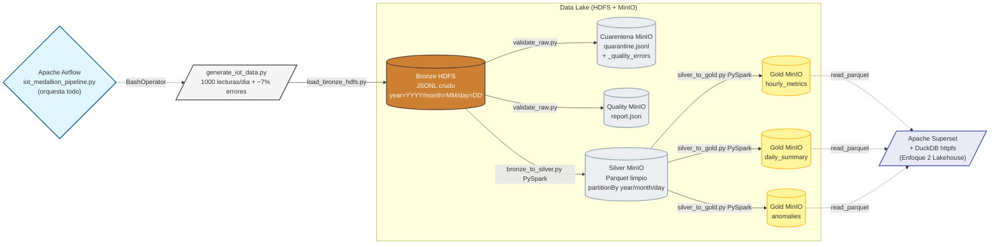

# Arquitectura del Pipeline Medallon IoT - Reto 02 RA5

**Alumno:** autor
**Modulo:** Big Data Aplicado - UT5
**Fecha:** 27/04/2026 - 27/05/2026

## Vision general

Pipeline completo de Big Data sobre datos sinteticos de un sensor IoT de aula
(`sensor_aula_01`), siguiendo la **arquitectura medallon** estandar de la
industria (Bronze - Silver - Gold), orquestado con Apache Airflow y visualizado
en Apache Superset.



## Filosofia de cada capa (UT5)

| Capa | Que es | Por que existe (UT5) |
|---|---|---|
| **Bronze** | JSONL **identico** al que llegaria de un sensor real, sin transformar | Si Silver/Gold se rompen, podemos reprocesar TODO desde aqui sin haber perdido ni un byte. Es la "fuente de la verdad" cruda. |
| **Silver** | Parquet columnar limpio, tipado, deduplicado | Es la base "de confianza" sobre la que cualquier analitica posterior puede operar sin volver a validar. Parquet (UT4) es columnar y comprimido, optimo para Spark/BI. |
| **Gold** | Datasets agregados pre-calculados (1 por chart del dashboard) | Evita que Superset recalcule millones de registros en cada refresh. La logica de negocio vive aqui (UT5: "Data Marts"). |

## Mapa de tecnologias por fase

| Fase | Tecnologia | Justificacion |
|---|---|---|
| Generacion | Python puro + uuid + datetime | UT3.4 ProductorResponsable: no hace falta dependencia pesada |
| Bronze HDFS | hdfs.InsecureClient (WebHDFS) | Patron del notebook 01_Demo_HDFS_S3 del profesor |
| Validacion | Pandas + PyYAML | UT3 todos los notebooks usan pandas; YAML separa reglas del codigo |
| Cuarentena | s3fs + JSONL en MinIO | Misma libreria que el notebook 01 del profesor |
| Bronze->Silver | **PySpark** (local[*]) | Requisito explicito del enunciado E4 (0.5 pt) + escala |
| Silver->Gold | **PySpark** (local[*]) | Mismo motor que la fase anterior, aprovecha el cache |
| Orquestacion | Airflow (BashOperator + docker exec) | Reusa jupyter-aula que ya tiene PySpark en lugar de duplicar |
| Visualizacion | Superset + DuckDB + httpfs | "Enfoque 2 Lakehouse" recomendado por el profesor (notebook 02) |

## Decisiones arquitectonicas y su justificacion

### 1. `docker exec` desde Airflow al contenedor jupyter-aula

**Decision:** En lugar de instalar Java + PySpark en la imagen de Airflow,
delegamos los pasos PySpark al contenedor `jupyter-aula` mediante
`docker exec`.

**Justificacion (UT4 + decision pedagogica del profesor):**
- `apache/airflow:2.8.3` es Python puro: añadir Java+Spark sumaria ~1.5 GB de RAM
- `jupyter-aula` YA tiene PySpark 3.5.0 + Hadoop 3.4.0 + Java 17 instalados
- Es analogo a la decision del profesor de compartir PostgreSQL entre Airflow y
  Superset (notebook 02 ETL_vs_Lakehouse): **REUSAR antes que duplicar**

**Implementacion:**
- `entorno_overrides/airflow.Dockerfile` instala `docker.io` (cliente CLI)
- `docker-compose.override.yml` monta `/var/run/docker.sock` en airflow

### 2. Bronze en HDFS, Silver y Gold en MinIO

**Decision:** Mezclamos los dos almacenamientos.

**Justificacion (enunciado + UT5):**
- El enunciado lo pide explicitamente: "Capa Bronze sobre HDFS", "Capa Plata
  en MinIO", "Capa Oro en MinIO"
- Pedagogicamente refleja la realidad del mercado: HDFS sigue vivo en muchos
  data centers para almacenamiento bruto pesado, MinIO/S3 es el estandar
  moderno para datos analiticos columnares
- Superset NO necesita el perfil `batch` (Hadoop pesado): puede leer Gold
  desde MinIO directamente con DuckDB. Esto permite alternar perfiles en
  maquinas de 8 GB de RAM sin perder los datos analiticos.

### 3. Conexion Spark -> MinIO con S3A

**Decision:** Usamos el conector S3A de Hadoop (URI `s3a://`) en lugar del
patron `pandas + storage_options + s3://` que enseña el profesor.

**Justificacion (extension natural sobre la teoria):**
- Pandas+s3fs es el patron del profesor en sus notebooks UT5 (notebook 01)
  porque alli usaba PyArrow, no Spark
- Cuando el cliente es Spark, el conector nativo es S3A (`org.apache.hadoop.
  fs.s3a.S3AFileSystem`); usar PyArrow desde Spark seria sub-optimo
- Mantenemos el MISMO endpoint (`minio:9000`), credenciales y `path-style`
  que enseña el profesor; solo cambia el adaptador

### 4. Superset con DuckDB (Enfoque 2 Lakehouse)

**Decision:** Conectamos Superset a MinIO via DuckDB + extension httpfs en
lugar de copiar Gold a PostgreSQL.

**Justificacion (notebook 02 ETL_vs_Lakehouse del profesor, comparativa):**

| Criterio | Enfoque 1 (ETL->Postgres) | Enfoque 2 (Lakehouse) | Ganador |
|---|---|---|---|
| Duplicacion de datos | Si (Parquet + tabla SQL) | No (un unico lugar) | E2 |
| Frescura | Re-ETL manual | Siempre el ultimo Parquet | E2 |
| Escalabilidad | Postgres se ahoga | DuckDB columnar | E2 |
| Complejidad | Baja | Media | E1 |

El profesor recomienda explicitamente E2 en el notebook. Lo seguimos.

## Profiles de Docker Compose y como combinarlos

El profesor diseño los profiles para que el entorno entre en 8 GB de RAM
alternando workloads. El reto requiere alternar:

| Momento | Comando |
|---|---|
| **Pipeline (Bronze->Silver->Gold)** | `docker compose -f docker-compose.yml -f entorno_overrides/docker-compose.override.yml --profile core --profile batch --profile orchestration up -d --build` |
| **Visualizacion (Superset)** | `docker compose -f docker-compose.yml -f entorno_overrides/docker-compose.override.yml down --remove-orphans` <br>seguido de<br> `docker compose -f docker-compose.yml -f entorno_overrides/docker-compose.override.yml --profile core --profile bi up -d` |

MinIO persiste via volumen `minio_data`, asi que los datos sobreviven a
los `down` entre cambios de profile.

## Estructura del repositorio entregado

```
src/
├── airflow/dags/iot_medallion_pipeline.py    # DAG completo (6 tareas reales)
├── jobs/
│   ├── lib_paths.py             # Constantes compartidas (UT3.4 contrato de datos)
│   ├── generate_iot_data.py     # E1 - Generador con errores controlados
│   ├── load_bronze_hdfs.py      # E2 - Sube JSONL crudo a HDFS
│   ├── validate_raw.py          # E3 - Reglas de calidad + cuarentena + informe
│   ├── bronze_to_silver.py      # E4 - PySpark Bronze HDFS -> Silver MinIO
│   └── silver_to_gold.py        # E5 - PySpark Silver -> 3 Gold datasets
├── quality/rules_iot.yaml       # Reglas declarativas (3 dimensiones)
├── notebooks/exploracion_iot.ipynb  # Verificacion manual end-to-end
└── docs/
    ├── arquitectura.md          # Este documento
    ├── diccionario_datos.md     # Esquemas por capa
    └── manual_ejecucion.md      # Como reproducir el reto

entorno_overrides/
├── airflow.Dockerfile           # Imagen Airflow extendida con docker.io + libs
└── docker-compose.override.yml  # Override sin tocar el compose del profesor
```
