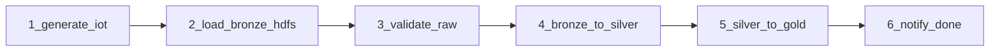

# Manual de Ejecucion - Reto 02 RA5

**Alumno:** autor
**Entorno:** `D:\entorno_bda_v1\` (entorno del profesor + override del alumno)

> Pre-requisito: tener el entorno del profesor (`entorno_bda_v1`) descargado
> y Docker Desktop arrancado con al menos 6 GB de RAM asignados.

---

## 0. Preparativos (una sola vez)

Desde la carpeta `D:\entorno_bda_v1\`:

```bash
# Construye la imagen extendida de Airflow (anyade docker.io + libs Python)
docker compose -f docker-compose.yml -f entorno_overrides/docker-compose.override.yml build airflow-init airflow-webserver airflow-scheduler
```

> El primer `build` tarda 2-3 minutos (apt-get + pip install).

---

## 1. Arrancar el pipeline (perfiles `core + batch + orchestration`)

```bash
cd D:\entorno_bda_v1
docker compose -f docker-compose.yml -f entorno_overrides/docker-compose.override.yml \
  --profile core --profile batch --profile orchestration up -d
```

Servicios que arrancan (8 contenedores):

| Contenedor | Puerto | Login | Para que sirve |
|---|---|---|---|
| `jupyter-aula` | http://localhost:8888 | (sin token) | Probar scripts manualmente, exploracion |
| `minio` | http://localhost:9001 | admin / adminadmin | Ver Silver y Gold visualmente |
| `namenode` | http://localhost:9870 | - | Ver Bronze (HDFS Explorer) |
| `resourcemanager` | http://localhost:8088 | - | Ver YARN (no se usa activamente) |
| `airflow-webserver` | http://localhost:8081 | admin / admin | Ejecutar el DAG |
| `datanode1`, `datanode2` | - | - | Almacenamiento HDFS |
| `airflow-scheduler` | - | - | Ejecuta las tareas |
| `postgres` | - | airflow / airflow | Metadatos Airflow |

**Verificar que todo esta arriba** (espera 1-2 min al primer arranque):

```bash
docker ps --format "table {{.Names}}\t{{.Status}}"
```

Si `airflow-init` aparece como `Exited (0)`, es normal (ya termino su trabajo).

---

## 2. (Opcional pero recomendado) Probar cada script manualmente desde Jupyter

Antes de lanzar el DAG completo, probar fase a fase desde Jupyter para
detectar errores de configuracion temprano (regla del profesor: "no empezar
por Airflow").

Abre [http://localhost:8888](http://localhost:8888) y en una terminal de Jupyter:

```bash
cd /home/jovyan/work/src/jobs

# 1. Generador (escribe local en /home/jovyan/work/data/raw/...)
python generate_iot_data.py --records 1000 --error-rate 0.07 --date 2026-04-27

# 2. Carga Bronze
python load_bronze_hdfs.py --date 2026-04-27 --raw-dir /home/jovyan/work/data/raw

# 3. Validacion
python validate_raw.py --date 2026-04-27 --rules /home/jovyan/work/src/quality/rules_iot.yaml

# 4. Bronze -> Silver (la primera vez tarda ~3 min descargando jars Spark)
python bronze_to_silver.py --date 2026-04-27

# 5. Silver -> Gold
python silver_to_gold.py --date 2026-04-27
```

Si todos terminan con `OK ... finalizado`, el pipeline funciona. Pasamos al DAG.

---

## 3. Ejecutar el DAG desde Airflow

1. Abre [http://localhost:8081](http://localhost:8081) (admin / admin)
2. Localiza el DAG `iot_medallion_pipeline` en la lista
3. Despausalo (toggle a la izquierda)
4. Pulsa **Trigger DAG** (boton play arriba a la derecha)
5. Observa el grafo: cada tarea pasara de blanco -> verde



**Tiempo aproximado del DAG completo:**
- Primera ejecucion: ~6-8 min (Spark descarga jars)
- Ejecuciones siguientes: ~2-3 min

**Si una tarea falla:**
- Click en la tarea -> Log -> revisar el error
- El DAG tiene `retries=1` (1-2 segun la tarea), reintenta automaticamente

---

## 4. Verificar resultados

### 4.1 Bronze (HDFS Explorer)

[http://localhost:9870](http://localhost:9870) -> Utilities -> Browse the file system
-> `/datalake/bronze/iot/sensor_aula_01/year=2026/month=04/day=27/`

Debe ver al menos un fichero `.jsonl` con tamaño > 0.

### 4.2 Silver y Gold (MinIO Console)

[http://localhost:9001](http://localhost:9001) (admin / adminadmin)
-> bucket `datalake`:

- `silver/iot/sensor_aula_01/year=2026/month=04/day=27/` -> ficheros `.parquet`
- `gold/iot/sensor_aula_01/hourly_metrics/` -> `.parquet`
- `gold/iot/sensor_aula_01/daily_summary/` -> `.parquet`
- `gold/iot/sensor_aula_01/anomalies/` -> `.parquet`
- `quality/iot/sensor_aula_01/2026-04-27/report.json` -> abre y lee
- `quarantine/iot/sensor_aula_01/2026-04-27/quarantine.jsonl` -> registros descartados

### 4.3 Exploracion programatica

Abre `src/notebooks/exploracion_iot.ipynb` en Jupyter y ejecuta todas las
celdas. Sirve como evidencia visual y permite generar las graficas para el PDF.

---

## 5. Cambiar a Superset y crear el dashboard

```bash
cd D:\entorno_bda_v1
docker compose -f docker-compose.yml -f entorno_overrides/docker-compose.override.yml down --remove-orphans
docker compose -f docker-compose.yml -f entorno_overrides/docker-compose.override.yml --profile core --profile bi up -d
```

Espera ~3 min (Superset migra su BD la primera vez). Despues abre
[http://localhost:8089](http://localhost:8089) (admin / admin).

### 5.1 Conectar Superset a MinIO via DuckDB

1. Settings (arriba derecha) -> **Database Connections**
2. **+ DATABASE** -> **Other**
3. SQLAlchemy URI: `duckdb:////tmp/superset_lakehouse.db`
4. Pestaña **Advanced** -> **Other** -> **Engine Parameters** (pegar JSON):

```json
{
  "connect_args": {
    "preload_extensions": ["httpfs"],
    "config": {
      "s3_endpoint": "minio:9000",
      "s3_access_key_id": "admin",
      "s3_secret_access_key": "adminadmin",
      "s3_url_style": "path",
      "s3_use_ssl": false
    }
  }
}
```

> **Importante**: `s3_use_ssl` es booleano `false` (sin comillas).

5. **TEST CONNECTION** -> debe responder OK -> **CONNECT** -> **FINISH**

### 5.2 Crear los 3 datasets virtuales

**SQL Lab** -> **SQL Editor** -> elegir la conexion DuckDB recien creada.
Para cada dataset, ejecuta la query y luego **Save as virtual dataset**:

```sql
-- Dataset 1: hourly_metrics
SELECT * FROM read_parquet('s3://datalake/gold/iot/sensor_aula_01/hourly_metrics/*.parquet');

-- Dataset 2: daily_summary
SELECT * FROM read_parquet('s3://datalake/gold/iot/sensor_aula_01/daily_summary/*.parquet');

-- Dataset 3: anomalies
SELECT * FROM read_parquet('s3://datalake/gold/iot/sensor_aula_01/anomalies/*.parquet');
```

### 5.3 Crear los 4 charts y el dashboard

**Charts** -> **+ Chart** -> elegir dataset -> tipo de visualizacion:

| Chart | Tipo | Dataset | Configuracion clave |
|---|---|---|---|
| 1 | **Line Chart** | `hourly_metrics` | Eje X: `hour`, Metricas: `AVG(temp_avg)`, `AVG(hum_avg)`, `AVG(co2_avg)` |
| 2 | **Bar Chart** | `daily_summary` | Eje X: `day`, Metrica: `SUM(n_events)` |
| 3 | **Big Number with Trendline** | `daily_summary` | Metrica: `AVG(co2_avg)`, Time column: derivada |
| 4 | **Table** | `anomalies` | Columnas: `timestamp`, `anomaly_type`, `temperature`, `co2` |

**Dashboards** -> **+ Dashboard** -> nombre: `IoT Aula - Medallon` -> arrastra
los 4 charts -> **SAVE**.

Sacar capturas de cada chart y del dashboard completo para el PDF.

---

## 6. Apagar todo

```bash
docker compose -f docker-compose.yml -f entorno_overrides/docker-compose.override.yml down --remove-orphans
```

> NO uses `down -v` salvo que quieras borrar todos los datos del Data Lake.

---

## Solucion de problemas frecuentes

| Problema | Causa probable | Solucion |
|---|---|---|
| `docker exec` falla en el DAG | Socket Docker no accesible | Reconstruir con `--build` para asegurar que `docker.io` esta en la imagen, y reiniciar Docker Desktop |
| Spark se cuelga en `getOrCreate()` | Descargando jars (primera vez) | Esperar 2-3 min. Si persiste, comprobar conexion a Maven Central |
| `NoSuchMethodError` al escribir s3a | Mismatch versiones jars | Las versiones del codigo (`hadoop-aws:3.3.4`, `aws-java-sdk-bundle:1.12.262`) son las testadas con Spark 3.5/Hadoop 3.4. NO cambiar |
| Superset no encuentra el Parquet | URL incorrecta | Usar `s3://` (no `s3a://`) con DuckDB. Path con glob `/*.parquet` al final |
| Jupyter no arranca | Aun construyendo Python | `docker compose logs -f jupyter` y esperar `Jupyter Server is running` |
